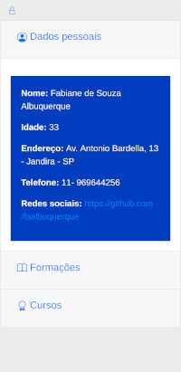
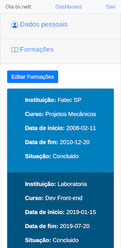

## Creating my Ruby & Rails resume

#### To access [click here!](https://curriculo-fabi.herokuapp.com/)
 
<hr>

### Technologies used: 

```
➡️ Ruby & Rails

➡️ HTML

➡️ CSS

➡️ BootStrap

➡️ Jquery

➡️ JavaScript

➡️ Devise

➡️ Heroku

➡️ PostgreSQL

➡️ ActiveRecord
```
<hr>

### Screens:

&nbsp;&nbsp;&nbsp;&nbsp;&nbsp;&nbsp;&nbsp;&nbsp;&nbsp;&nbsp;&nbsp;&nbsp;&nbsp;&nbsp;&nbsp;&nbsp;&nbsp;&nbsp;  &#160;&#160;&#160;&#160;&#160;&#160;
 <br><br>
&nbsp;&nbsp;&nbsp;&nbsp;&nbsp;&nbsp;&nbsp;&nbsp;&nbsp;&nbsp;&nbsp;&nbsp;&nbsp;&nbsp;&nbsp;&nbsp;&nbsp;&nbsp;  &#160;&#160;&#160;&#160;&#160;&#160;

