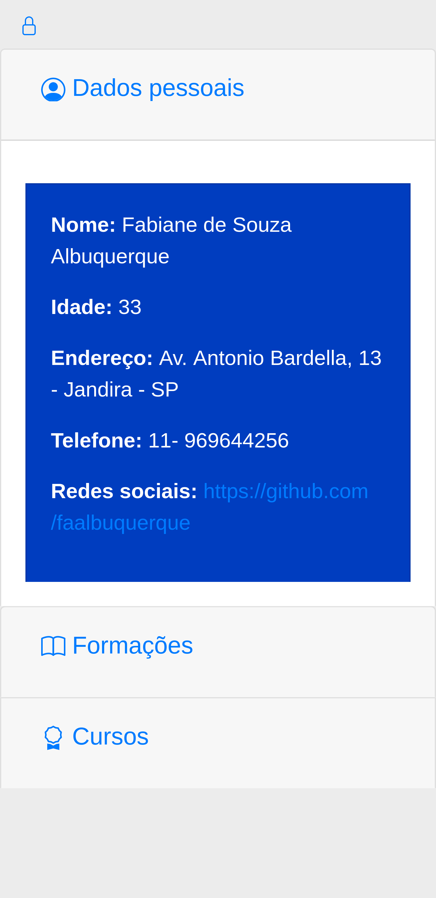
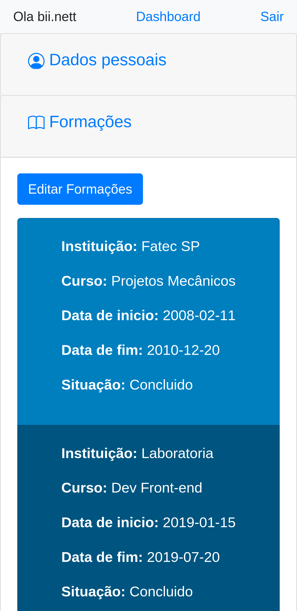

# Meu curriculo feito em Ruby & Rails:
 
 Para acessar [clique aqui](https://curriculo-fabi.herokuapp.com/)

Tecnologias utilizadas:

* Ruby & Rails

* HTML

* CSS

* BootStrap

* Jquery

* JavaScript

* Devise

* Heroku

* PostgreSQL

* ActiveRecord

